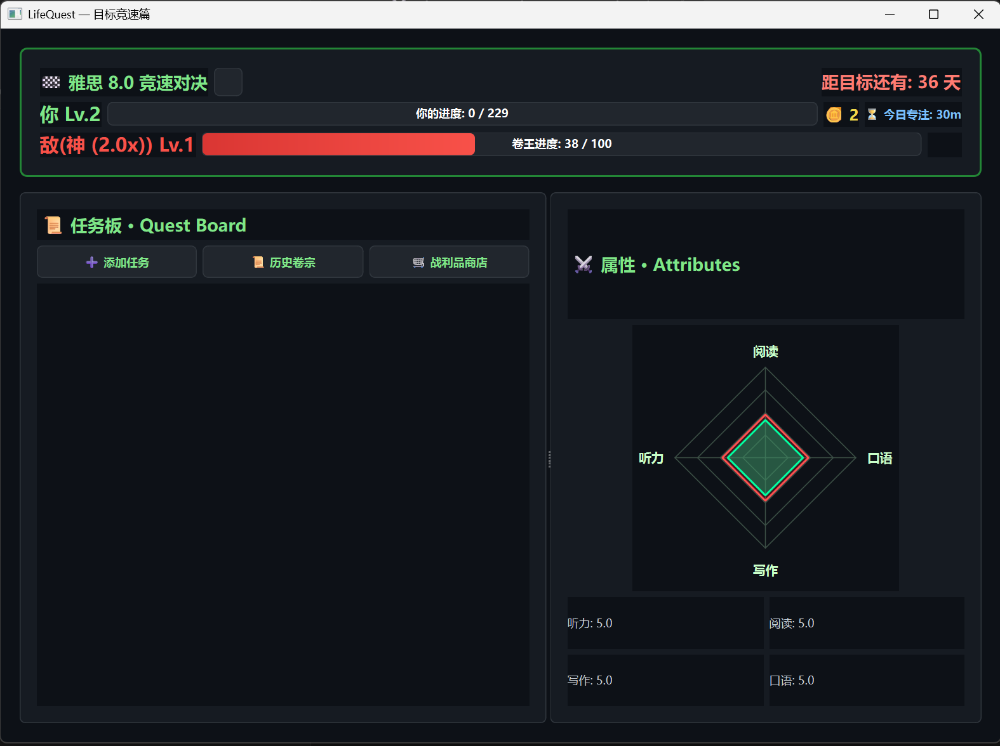
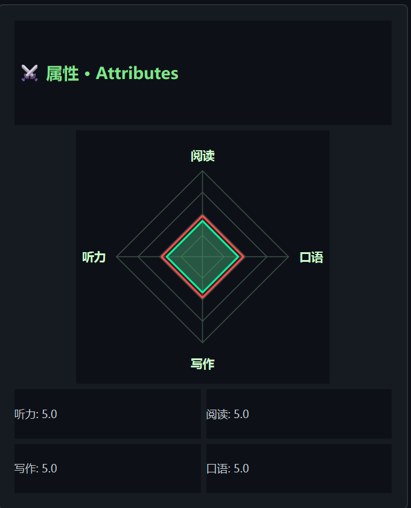
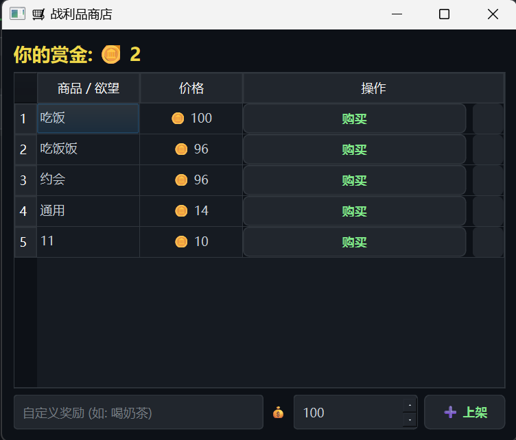
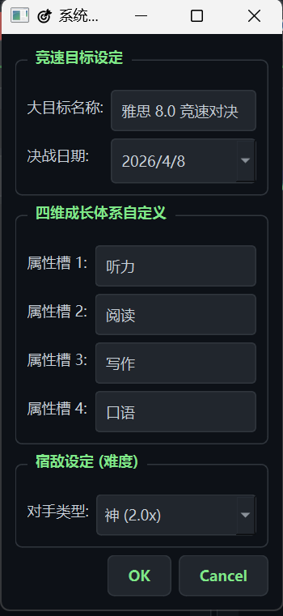

# ⚔️ LifeQuest: Gamify Your Reality (v2.0)
> **现实人生 RPG 化 —— 你的目标，就是最后的 Boss。**
> **Turn your life goals into an RPG adventure.**

---

## 📖 简介 (Introduction)

**LifeQuest** 是一款硬核的目标管理工具，专为那些厌倦了枯燥 To-Do List 的奋斗者设计。我们将备考、工作或锻炼转化为一场史诗级的 RPG 战役。

v2.0 版本带来了全新的**战利品商店**与**智能宿敌系统**。你不再是单纯的刷数据，而是通过赚取赏金（Gold）来兑换现实中的奖励（如：喝奶茶、看电影）。

**LifeQuest** transforms your daily grind into an RPG. Grind XP, earn Gold, and battle against an algorithm-driven **"Rival"**. In v2.0, spend your hard-earned Gold in the **Black Market** to reward yourself in real life.

---

## ✨ 核心特性 (Key Features)

### 📊 1. 四维属性雷达 (Attributes Radar)
根据你的任务类型（如：背单词、写代码、健身），动态提升四维属性：
*   **Perception (感知)** | **Insight (洞察)** | **Logic (逻辑)** | **Charisma (魅力)**
> *Visualize your growth with a dynamic radar chart.*

### 😈 2. 智能宿敌系统 (Smart Rival System)
你有一个永远在成长的宿敌。即便你休息，他也在离线挂机升级。
*   **4档难度**：从 "摸鱼怪 (0.5x)" 到 "神 (2.0x)"，只有强者才配挑战神。
*   **随机行为**：对手每天随机上线完成任务，行为更像真人。
> *Choose your rival's difficulty tier. They level up even when you sleep.*

### 🛒 3. 战利品商店 (The Black Market)
*   **赚取赏金**：完成任务获得金币。
*   **购买欲望**：自定奖励（如"游戏1小时"），用金币购买。这是对自律最好的正反馈。
> *Earn Gold by completing tasks and spend it on real-life rewards.*

### ⏳ 4. 专注时光 (Focus Tracker)
*   **时长统计**：记录每个任务的专注时间。
*   **动态反馈**：主界面实时显示今日总投入时长，从蓝色（懈怠）到红色（爆肝）。
> *Track your daily focus duration with color-coded feedback.*

### 📜 5. 史诗卷宗 (Chronicles & Backup)
*   **树状历史**：按日期自动归档你的战斗记录。
*   **数据安全**：一键导出 JSON 备份，你的努力永不丢失。

---

## 🚀 安装 (How to Update/Install)

### 全新安装 (New User)
1. 下载最新发布的 `LifeQuest_Release.zip`。
2. 解压到任意文件夹。
3. 确保 `.wav` 音效文件与 `.exe` 在同一目录。
4. 双击 `LifeQuest_RPG.exe` 启动。

## 📸 截图 (Screenshots)

| **主战场 & 专注统计** | **属性雷达** |
|:---:|:---:|
|  |  |

| **战利品商店** | **宿敌设置** |
|:---:|:---:|
|  |  |

---

> *"The only easy day was yesterday."*  
> **立即开始你的 LifeQuest，击败那个懒惰的自己！**

Made with ❤️ by Zezheng