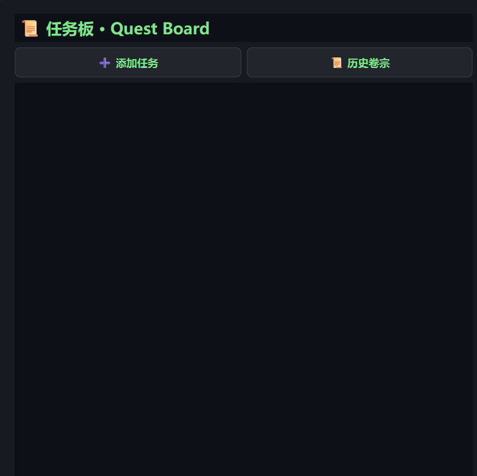
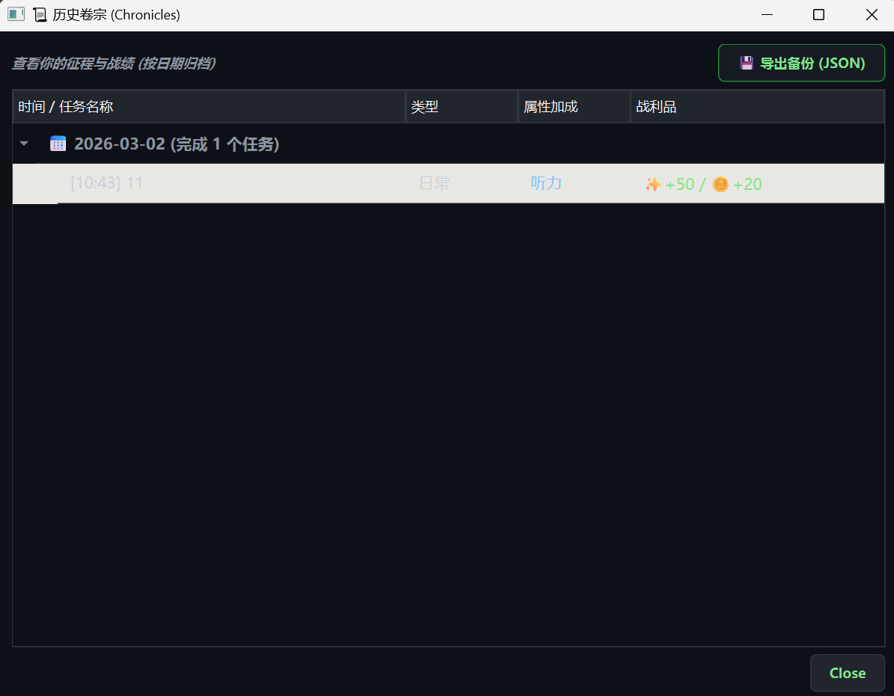

# ⚔️ LifeQuest: Gamify Your Reality
> **现实人生 RPG 化 —— 你的目标，就是最后的 Boss。**
> **Turn your life goals into an RPG adventure.**

---

## 📖 简介 (Introduction)

**LifeQuest** 是一款硬核的目标管理工具，专为那些厌倦了枯燥 To-Do List 的奋斗者设计。我们将枯燥的备考、工作或锻炼转化为一场史诗级的 RPG 战役。

在这里，你不再是一个默默无闻的学生或打工人，而是一名正在积攒经验值（XP）的战士。你的对手不是枯燥的单词书，而是一个由算法驱动的、日夜不休的**"影子宿敌" (The Rival)**。

**LifeQuest** is a hardcore goal-management tool designed for those tired of boring To-Do lists. We transform your study, work, or fitness routines into an epic RPG campaign.

You are no longer a student or worker; you are a warrior grinding for XP. Your enemy is not the textbook, but an algorithm-driven **"Rival"** who never sleeps.

---

## ✨ 核心特性 (Key Features)

### 📊 1. 四维属性雷达 (4-Dimension Attributes Radar)
摒弃单一的进度条。根据你的任务类型（如：背单词、写代码、健身），动态提升四维属性。
*   **Perception (感知/听力)**
*   **Insight (洞察/阅读)**
*   **Logic (逻辑/写作)**
*   **Charisma (魅力/口语)**
> *Customizable attributes to fit any goal, from IELTS prep to Coding interviews.*

### 😈 2. 宿敌竞速系统 (The Rival System)
你有一个永远在成长的宿敌。即便你休息，他也在离线挂机升级。
*   **实时竞速**：双进度条对比，直观感受压迫感。
*   **动态难度**：你越强，他也越强。
> *An offline-growing rival keeps you on your toes. Even when you rest, your rival is leveling up.*

### 💥 3. 沉浸式反馈 (Immersive Feedback)
*   **打击感 UI**：Cyberpunk 风格暗色界面，霓虹配色。
*   **视听盛宴**：完成任务触发屏幕震动、漂浮文字暴击特效及自定义 WAV 音效。
> *Screen shakes, floating damage text, and heavy sound effects make completing tasks feel like landing a critical hit.*

### 📜 4. 史诗卷宗 (Chronicles & Backup)
*   **树状历史**：按日期自动归档你的战斗记录。
*   **数据安全**：一键导出 JSON 备份，你的努力永不丢失。
> *Track your history with a tree-view log and export your data to JSON for safety.*

---

## 🚀 快速开始 (Getting Started)

### 下载与运行 (Run)
无需安装 Python 环境。
1. 下载最新发布的 `LifeQuest_Release.zip`。
2. 解压到任意文件夹。
3. 确保 `.wav` 音效文件与 `.exe` 在同一目录。
4. 双击 `LifeQuest_RPG.exe` 启动。

### 配置你的目标 (Configuration)
1. 点击主界面标题旁的 **⚙️ (设置)** 按钮。
2. 输入你的**大目标名称**（如 "雅思 8.0" 或 "减肥 10kg"）。
3. 设定 **决战日期**（Deadline）。
4. 自定义你的 **四维属性** 名称。

---

## 📸 截图 (Screenshots)

| **主战场 (Main Interface)** | **属性雷达 (Radar Stats)** |
|:---:|:---:|
|  |  |

| **任务板 (Quest Board)** | **历史卷宗 (History Log)** |
|:---:|:---:|
|  |  |

---

## 🛠️ 技术栈 (Tech Stack)

*   **Core**: Python 3.11
*   **GUI Framework**: PyQt6 (Modern, High-DPI support)
*   **Database**: SQLite3 (Local storage, no server needed)
*   **Animation**: QPropertyAnimation & QGraphicsOpacityEffect

---

> *"The only easy day was yesterday."*  
> **立即开始你的 LifeQuest，击败那个懒惰的自己！**

Made with ❤️ by Zezheng04